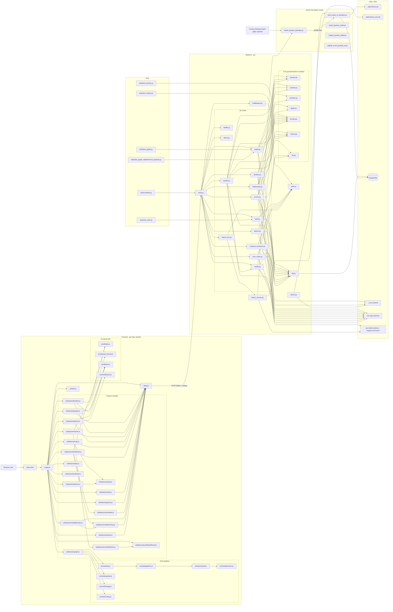
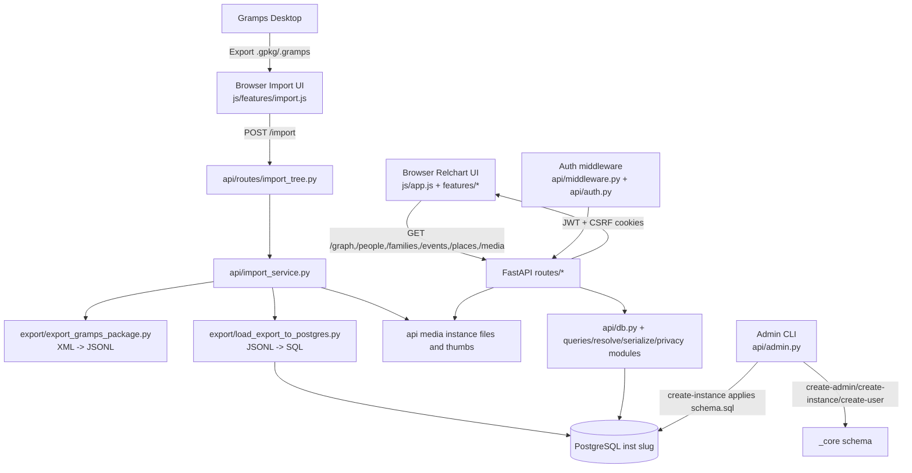

# System Script Flow Graph (full app complexity map)

This is a personal architecture map showing how scripts connect and how data moves across the whole system.

## 1) Full system graph (scripts + data flow)

## 2) Focused data-movement view (app-to-app flow)

## 3) How to use this map

- Read left to right for runtime call flow.
- Frontend graph rendering is a two-phase pipeline: DOT generation, then SVG post-processing.
- Import path is intentionally separate from normal read APIs.
- Multi-instance isolation happens at `db_conn(instance_slug)` via schema-based `search_path`.
- Media has dual persistence: DB metadata in Postgres + binaries on filesystem.
